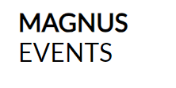
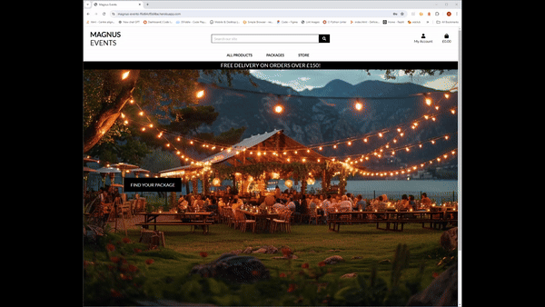
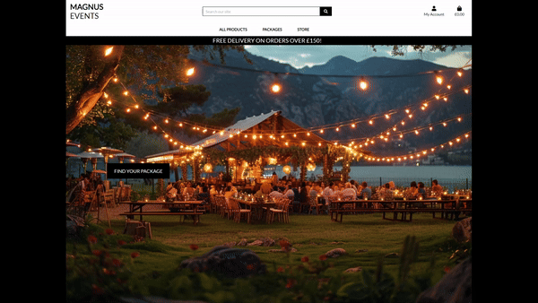
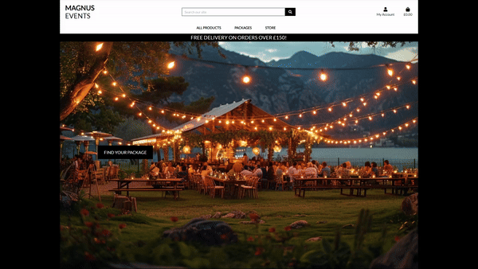
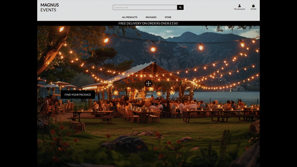

# Magnus Events
----------------
This website was created as the 4th Milestone Project for Code Institute's web application development course.

  

**[Link to the Deployed Site](https://magnus-events-f6d64cf0d4be.herokuapp.com/)**
  
----------------

## Contents
  

* [User Experience](#user-experience)
    * [Owner Goals](#owners-goals)
    * [Shoppers Goals](#shoppers-goals)
* [Design](#design)
    * [User Stories](#user-stories)
    * [WireFrames](#wireframes)
    * [Database Schema](#database-schema)
    * [Styling](#styling)
* [Feautres](#features)
    * [Multi-Page Features](#mutli-page-features)
    * [Homepage](#homepage)
    * [Products Page](#products)
    * [Product Details Page](#product-details-page)
    * [Bag Page](#bag-page)
    * [Checkout Page](#checkout-page)
    * [Checkout Success Page](#checkout-success-page)
    * [Profile Page](#profile-page)
    * [Add Product Page](#add-product-page)
    * [Edit Product Page](#edit-product-page)
    * [Enquiries Page](#enquiries-page)
    * [Allauth Pages](#allauth-pages)
* [Technologies](#technologies)
* [Testing](#testing)
* [Deployment](#deployment)
* [Credits](#credits)

  

----------------

## User Experience

**Magnus Events** was created to offer a customer-focused solution for designing and executing personalized events. We provide a wide array of event options, allowing customers to find everything they need in one place rather than sourcing from multiple providers.

### Owners Goals
- The owner aims to provide a tailored event planning experience, offering a diverse selection of event options and services to cater to various customer preferences and needs.
- The owner wants to ensure that customers have a smooth and enjoyable experience on the website. This involves creating an intuitive, easy-to-navigate platform that simplifies the event planning process.
- The owner values customer feedback and aims to create a space where users can share their opinions and experiences. This feedback will be used to continually improve services and assist future customers in making informed decisions.
- Customer satisfaction is paramount. The owner is committed to delivering exceptional customer service, which includes prompt responses to inquiries, comprehensive support throughout the event planning process, and addressing any issues that may arise efficiently.

### Shoppers Goals
- Shoppers want to explore a wide variety of event options and services to find the perfect fit for their unique needs and preferences.
- Some shoppers might have specific event details in mind and want a straightforward way to find and customize these options.
- Shoppers seek a user-friendly website with a secure and smooth checkout process, ensuring a hassle-free experience from start to finish.
- Shoppers need easy access to customer support for any questions, concerns, or assistance they might need with their event planning.
- Shoppers appreciate timely responses to their inquiries and interactions with the website, whether they're making a purchase or seeking help.

### Returning users
-
-
-
-

## Design

### User Stories

From the goals outlined above, user stories were created to ensure that development efforts are aligned with user needs and preferences.

| **USER STORY #**                 | **AS A** | **I WANT TO BE ABLE TO...**                                                          | **SO THAT I CAN...**                                                                  |
| ------------------------------------ | --------------- | ---------------------------------------------------------------------------------------- | ----------------------------------------------------------------------------------------- |
| **VIEWING & NAVIGATION**         |                 |                                                                                          |                                                                                           |
| 1                                    | User         | Easily navigate through the site.                                                        | Quickly find and explore various event planning options.                                                |
| 2                                    | User         | Browse event services within a specific category.                                              | Locate the services I need without extensive searching.                           |
| 3                                    | User         | Access detailed information about individual event services.                                   | Understand the specifics, pricing, and reviews of each service.     |
| 4                                    | User         | Conveniently view the total cost of selected services throughout my visit.    | Make informed decisions and stay within my budget.                                 |
| 5                                    | User         | Effortlessly switch between different event categories and services.    | Quickly find the specific services I'm looking for.                                         |
| **REGISTRATION & USER ACCOUNTS** |                 |                                                                                          |                                                                                           |
| 6                                    | User         | Register for an account with ease.                                                       | Enjoy the convenience of a personal account with access to my event planning history.                    |
| 7                                    | User         | Receive a confirmation email promptly after registering.                                 | Confirm that my account has been successfully created.                         |
| 8                                    | User         | Conveniently log in and out of my account.                                     | Access and manage my personal account information.                                        |
| 9                                    | User         | Effortlessly recover my password if forgotten.                                           | Quickly regain access to my account if needed.                                            |
| 10                                   | User         | Enjoy a personalized user profile.                                                       | Review my complete event planning history and saved preferences.                     |
| **SORTING & SEARCHING**          |                 |                                                                                          |                                                                                           |
| 11                                   | User         | Sort available services based on preferences.                                            | Easily find services by price, category, or name.                |
| 12                                   | User         | Organize services within a specific category.                                            | Locate the best options within specific event categories.                                |
| 13                                   | User         | Search for services by name or description with ease.                                    | Quickly find specific services I intend to use.                                |
| **PURCHASING & CHECKOUT**        |                 |                                                                                          |                                                                                           |
| 14                                   | User         | Easily select desired quantities for services during the booking process.             | Avoid selecting an incorrect service quantity.                            |
| 15                                   | User         | Receive on-screen notifications when adding services to my booking list.                 | Get instant feedback to confirm my selections.      |
| 16                                   | User         | View items in my booking list for easy checkout.                                         | Clearly see the total cost and details of my selections before finalizing.      |
| 17                                   | User         | Adjust quantities for individual items in my booking list.                               | Modify my selections before proceeding to checkout.                    |
| 18                                   | User         | Enter payment information securely and conveniently.                                     | Complete the checkout process swiftly and securely.                                     |
| 19                                   | User         | Trust that my personal and payment information is kept safe and secure.                  | Provide necessary information for the booking with confidence.                           |
| 20                                   | User         | Receive an order confirmation after completing a booking.                               | Verify that all details are accurate to prevent any mistakes.                    |
| 21                                   | User         | Get an email confirmation after the checkout process.                                    | Retain a confirmation of my booking for future reference.                       |
| **SERVICE REVIEWS**              |                 |                                                                                          |                                                                                           |
| 22                                   | User         | Access available service reviews while browsing.                                         | Gain valuable insights from other customers about the service.                          |
| 23                                   | User         | Easily understand how to contribute my own reviews.                                      | Decide whether to share my experience based on my satisfaction.                 |
| 24                                   | User         | Submit my own review of the service.                                                     | Share my personal experience with the community.                                  |
| 25                                   | Store Owner     | Edit or update previously submitted reviews.                                             | Maintain the quality and appropriateness of reviews on the site.           |
| 26                                   | Store Owner     | Delete a review if necessary.                                                            | Remove any inappropriate or offensive comments. |
|| **ADMIN & STORE MANAGEMENT**     |                 |                                                                                          |                                                                                           |
| 27                                   | Store Owner     | Add new products to the store.                                                           | Add new items to my store's inventory.                                                    |
| 28                                   | Store Owner     | Edit or update existing product information.                                             | Modify product details, including price, description, manufacturer, etc.                   |
| 29                                   | Store Owner     | Remove products from the store.                                                          | Remove items that are no longer available for sale from the inventory.                    |
| 30                                   | Store Owner     | See all unresponded messages from users.                                                 | Respond to users in a timely manner.                                                      |
| 31                                   | Store Owner     | Have an easy-to-use interface to respond to inquiries and see details of the inquiries.  | Respond to users' inquiries with a detailed response.                                      |

  

### WireFrames 

Wireframes created using balsamiq.

Homepage - Desktop

 

Products - Desktop

 

Product Detail - Desktop

 

Bag - Desktop

 

Checkout - Desktop

 

Register - Desktop

 

Login - Desktop

 

Logout - Desktop

 

Profile - Desktop

 

Order History - Desktop

 

Delivery Address - Mobile

 

### Database Schema

Schema to show tables in database along with their relation to each other, also included is the allauth-user schema to show custom tables relationship.

  

### Styling

A plain background enables the images to stand out and attract customer attention. The hero image has been placed to provide a calming effect while also referencing some of the selling points of the site. Planning events can be a stressful experience, which highlights the importance of having a calm and cohesive styling for the site.

All images were created using an AI generator [MidJourney](https://www.midjourney.com/home). The images were cycled multiple times to find the best ones for the site and to ensure that the aesthetics were followed.

   

 ## Features

 ### Mutli-Page Features

 #### Navbar

- Top Navigation Overview: The website's top navigation is designed to provide essential functionalities that enhance user experience and accessibility. Located prominently at the top of the page, it includes vital elements such as the site logo, a search bar for product queries, and options for user account management. Visitors can easily identify and interact with these features, facilitating seamless navigation throughout the site. A notable feature is the "My Account" icon, offering options for both registration and login. Additionally, users can monitor their shopping experience by viewing the number of items in their shopping bag directly from the top navigation, ensuring convenience and efficiency in browsing and purchasing products.

Navbar - Desktop

 

- User-Specific Dropdown Menu: Upon logging in, users encounter a dropdown menu within the "My Account" section that caters to their specific roles and needs. For Shop Owners/Administrators, this menu provides access to critical tools like "Product Management", empowering them to manage inventory.

Navbar - Mobile

 

- Logout Functionality: Both Shop Owners/Administrators and shoppers benefit from a straightforward logout process integrated into the "My Account" dropdown menu. This feature allows users to securely end their sessions when they have completed their tasks or wish to exit the site. The logout functionality enhances security by ensuring that user sessions are properly managed and terminated as needed. This contributes to a user-friendly experience where individuals can navigate the site confidently, knowing they have convenient access to essential account management tools and the ability to securely log out when necessary.

My Account - Logged out

 

- This deliberate design ensures that visitors can seamlessly and intuitively navigate the site, regardless of their device or screen size, enhancing their overall browsing experience.
  

#### Footer

- The footer is strategically positioned on specific areas of the site where users may need access, ensuring it blends seamlessly with the site's aesthetic and enhances user experience. Prior to its placement, careful consideration was given to maintaining the site's visual appeal and ensuring intuitive navigation.

- within the footer, users will discover concise yet pertinent information directing them to relevant social media platforms associated with the website. This feature allows users to connect with the site's community and stay updated on related news and updates.

- Additionally, an important disclaimer is included in the footer, notifying users that all payments processed through Stripe are conducted in test mode. This transparency sets clear expectations for users engaging in transactions on the site, ensuring they understand the operational status of payment processing.

Footer - Desktop

 

#### Toasts

Toasts are utilized throughout the site. Toasts are small, non-intrusive notifications that are displayed to the user to convey various types of messages. They serve the purpose of providing feedback or important information in a visually unobtrusive manner.

1. Success Toast:
Indicates that an action or process was successful. Accented in green.

2. Error Toast:
Alerts the user about an error or problem that occurred. Accented in red.

3. Info Toast:
Provides informative messages that do not require immediate action from the user. Accented in blue.

4. Warning Toast:
Warns the user about a situation that may require their attention. Accented in yellow.

#### Logo 

The Logo 

The logo was selected for its strategic use of bold text to emphasize "Magnus" within "Magnus Events." This choice enhances brand recognition and memorability by creating a clear visual hierarchy and ensuring readability across various mediums. It differentiates the brand from competitors while making a strong and lasting impression on viewers.

Logo

 

  

### Homepage

The homepage has a minimalist design, featuring a tagline that encapsulates the essence of the store. A Call-to-Action (CTA) button guides visitors to explore the comprehensive range of products available on the site. This deliberate simplicity ensures that the homepage remains uncluttered, with a special emphasis on directing the user to the diverse collection of anime apparel.

Homepage - Desktop

 

  

### Products

1. The Products Page dynamically showcases products sourced from the database, contingent upon selected filtering options including category, subcategory and search terms.

Products

 

Store

 

  

2. Products Information: Positioned below the sort selector on mobile and to the left of the page on desktop, this paragraph provides users with essential information. It includes details such as the total number of products available and any active search terms.

Products Information

 

  

3. Sort Selector: Positioned near the top of the page, this dropdown menu enables users to organize products according to criteria such as price, name, rating, and category..

Sort Selector

 

  

4. Product Cards: Each product is displayed in an individual card format. Cards are arranged in column amounts suitable for screen size of the user. The card includes:

Product Card

 

  

5. Edit and Delete Links: Additional options available on product cards to shop owners or administrators. These links allow for administrative actions to be performed on the product.

Edit and Delete Links

 

  

### Product Details Page

 1. The Product Details Page plays a pivotal role in guiding users through their shopping journey, providing them with the information and tools they need to make informed purchasing decisions. It combines visual appeal with functional features to create an engaging and user-friendly shopping experience.

* Product Name: Clearly states the name of the product.
* Item Description: Displays further initial further details of the product.
* Detail 1 created to break down information for packages.
* Detail 2 created to break down information for packages.
* Price: Indicates the cost of the product.
* Category: Specifies the specific category to which the product belongs redirects to a view of products filtered by relevant category or subcategory.

Product Detail

 

  

2. The Quantity Input Box allows users to specify the exact number of products they wish to add to their shopping bag, ensuring precision in their orders. This feature includes controls that prevent users from entering quantities outside the range of 1 to 99 by disabling the increment and decrement buttons. Additionally, the input field validates the form upon submission, maintaining order accuracy throughout the checkout process.
By restricting the quantity selection to a defined range and implementing validation on form submission, the Quantity Input Box enhances user experience by preventing errors and ensuring that orders meet specified criteria. This approach not only simplifies the ordering process but also contributes to a smoother checkout flow, where users can confidently input their desired quantities without encountering technical issues or discrepancies.

Quantity Input Box

 

  

3. "Keep Shopping" and "Add to Bag" Buttons: Offer two distinct options for user actions. "Keep Shopping" allows users to continue browsing products, while "Add to Bag" submits the quantity input form and places the selected item into their shopping bag.

"Keep Shopping" and "Add to Bag" Buttons

 

  

4. Edit and Delete Links: Additional options available on product details page to shop owners or administrators. These links are located underneath the product name and allow for administrative actions to be performed on the product.

Edit and Delete Links

 

  

### Bag page

The Bag page enhances the overall shopping experience by giving users control over their selections, enabling them to review and modify their choices, and providing transparent cost information.

Bag

 

 **Bag Page Components**
 
 1. Product add to bag Toast:

* Product Image: Displays a visual representation of the product, providing users with a clear visual reference.

* Product Name: Identifies the name or title of the product, ensuring easy recognition.

* Product SKU: Provides a unique identifier for the product, aiding in inventory management.

* Product Price per Unit: Indicates the cost of a single unit of the product, allowing users to understand the pricing structure.

* Quantity Input Box: Allow users to increment or decrement the quantity of the product in their shopping bag, facilitating easy adjustments.

* Sub-Total per Item: Displays the total cost for each individual product based on the quantity selected.

Product Information Section

 

2. Bag Summary:

* Bag Total: Reflects the cumulative cost of all the items currently in the shopping bag.

* Delivery Cost: Indicates any associated delivery charges.

* Grand Total: Provides the total cost of all products in the shopping bag, including both product costs and any applicable delivery charges.

* Free Delivery Threshold Alert: If the grand total is below the free delivery threshold, a prominent text in red advises the shopper how much more they need to spend to qualify for free delivery.

Bag Summary

 

  

3. Shopping Bag Buttons:

Keep Shopping CTA: A button that redirects the user back to the products page, allowing them to continue browsing and adding more items to their shopping bag.

Secure Checkout: This button initiates the checkout process, leading the user to a secure page to complete their purchase.

Shopping Bag Buttons

 

  

### Checkout Page

The Checkout Page plays a pivotal role in ensuring a smooth and secure transition from product selection to order confirmation. It provides users with the necessary tools and information to review, confirm, and successfully complete their purchase.

Checkout - Desktop

 

  

**Checkout Page Components**

1. Order Form: Collects essential information from the user, including personal details, delivery address, and payment information. This ensures accurate processing and delivery of the order.

* User Details:
    - Full Name
    - Email Address
   

* Delivery Information:
    - Phone Number
    - Street Address Line 1
    - Street Address Line 2 (Optional)
    - Town/City
    - County/Region (Optional)
    - Country (Dropdown Selection)
    - Postal Code

* Payment Information:
    - Card Information (Handled by Stripe)

Order Form

 

  

2. Order Summary: Provides a clear and detailed overview of the user's selected items, including product images, quantities, names, and subtotals. This allows users to review their order before finalizing the purchase.

For Each Item in the Order:
* Product Image
* Quantity
* Product Name
* Subtotal for the Item

 At the Bottom of the Order Summary:
* Order Total
* Delivery Cost
* Grand Total
If the Grand Total is below the free delivery threshold, a red text warning will inform the user how much more they need to spend to qualify for free delivery.

Order Summary

 

  

3. Buttons:

"Adjust Bag" Button: Allows users to go back to the shopping bag page to make any necessary adjustments before finalizing the order.

"Complete Order" Button: Submits the order form for processing. Payment is handled securely by Stripe.

Checkout Buttons

 

  

4. User Authentication Links and Profile Integration:

If the user is not logged in, there are links provided to either register for a new account or log in if they already have an existing account. This ensures the accuracy of the delivery information and allows for order tracking.

If the user is logged in, a checkbox option is available to add this delivery information to their user profile. This feature streamlines the ordering process for future purchases, making it more convenient for the user.

User Authentication Links and Profile Integration

 

User Authentication Links and Profile Integration

 

  

### Checkout Success Page

After the successful processing of an order, the shopper is automatically redirected to the Checkout Success Page. This page provides a comprehensive receipt that includes the following details:

Checkout Success - Desktop

 

Checkout Success - Mobile

 

  

**Checkout Success Page Components**

1. Order Information:

* Order Number or Reference ID.

* Order Details. Comprehensive information about each item in the order, including:
    - Product Name
    - Quantity
    - Price per Unit
    - Subtotal
    - Delivery Information:

* Details about where the order will be delivered, including:
    - Address
    - Any specific delivery instructions (if provided)
    - Billing Information:

* Summary of the billing details used for the transaction.

2. Return to Products Button:

This button allows the shopper to return to the Products Page, giving them the opportunity to explore more items or categories.

3. Confirmation Email:

A confirmation email is automatically sent to the user's provided email address. The email includes a summary of the order.

### Profile Page

The Profile Page serves as a hub for users to manage their default delivery information, review their order, reviews and enquiries history. It contributes to a seamless and personalized user experience. Ability to access profile page is limited to authenticated users.

Profile - Desktop

 

Profile - Mobile

 

  

**Profile Page Components**

1. Default Delivery Information Form:
* Full Name
* Street Address 1
* Street Address 2
* Town/City
* County/Region
* Country (Dropdown Selection)
* Postal Code

Default Delivery Information

 

  

2. Accordion Sections:
* Order History:
Displays past orders with the following details for each order:
- Order Number (Link to Past Order Confirmation)
- Date of Order
- Items in Order
- Order Total

Order History

 

  

* Reviews Section:
Lists all reviews made by the user, along with options for edit and delete actions.

Reviews

 

  

* Messages Section:
Displays contact form submissions made by the user, indicating whether a response has been sent or not.

Messages

 

  

Upon loading the page, the "Order History" section of the accordion is automatically open, displaying the user's order history.

Expanding another section automatically collapses the currently open section. This ensures that only one section of the accordion is open at a time, providing a clean and organized user interface.

### Add Product Page

 The Add Product page is an essential tool for maintaining and expanding the store's product catalog, allowing Shop Owner/Administrators to efficiently and accurately add new items for customers to explore and purchase. Access to this page is limited specifically to Superusers.

Add Product - Desktop

 

Add Product - Mobile

 

  

**Add Product Page Components**

Add Product Form:
* Category Dropdown: Allows the user to select the appropriate category for the new product from a list of available categories stored in the database.
* Subcategory Dropdown: Populated dynamically based on the selected category, utilizing an AJAX request and response when category field is changed to provide relevant subcategory options.
* SKU: Enables the user to input the Stock Keeping Unit (SKU) for the new product.
* Name.
* Description.
* Manufacturer.
* Price Field.
* Product Image Widget: Provides functionality to upload an associated image with the new product.

Category and Subcategory Dropdowns

 
<video src="" controls="controls"></video>

  

### Edit Product Page

The Edit Products page serves the purpose of allowing users to make modifications to an existing product. It shares a similar structure with the Add Product page, but the form is prepopulated with the current product data. Ability to edit products is limited to the Shop Owner/Administrator.

Edit Product - Desktop

 

Edit Product - Mobile

 

  

### Enquiries Page

The purpose of the Enquiries page is to serve as a centralized hub for managing and responding to user enquiries or messages directed to the shop owner. The page is populated with only unresponded enquiries and is accessible exclusively by superusers.

Enquiries - Desktop

 

Enquiries - Mobile

 

  

### Allauth Pages

Site utilizes allauth for user account creation and authentication. Allauth is a powerful authentication framework for Django that streamlines the process of implementing user authentication and account management features in your web application. It offers a wide range of functionalities to handle user registration, login, email confirmation and password management.

1. User Registration: allauth provides a robust mechanism for user registration. Users can sign up by providing essential information such as username, email, and password.

2. Email Confirmation: After registration, allauth automatically sends a confirmation email to the user's provided email address. This ensures that the user's email is valid and accessible.

3. Login and Logout: Users can securely log in to the application using their registered credentials. allauth also offers a user-friendly logout process.

4. Password Management: Users can reset their password if they forget it, and allauth handles the entire password reset flow, including sending reset emails and updating the password.

5. Integration with Django Admin: allauth seamlessly integrates with the Django admin interface, making it easy to manage user accounts and authentication settings.

## Technologies

### Languages

* HTML5 - for content and structure.
* CSS3 - for styling.
* JS/JQuery - for frontend functionality and functions that request and handle data from the backend.
* Python - for the backend functionality.
* Python Modules used -
* asgiref==3.2.3
* boto3==1.12.42
* botocore==1.15.42
* chardet==3.0.4
* dj-database-url==0.5.0
* Django==3.0.1
* django-allauth==0.41.0
* django-countries==6.0
* django-crispy-forms==1.8.1
* django-storages==1.9.1
* docutils==0.15.2
* gunicorn==20.0.4
* idna==2.8
* jmespath==0.9.5
* oauthlib==3.1.0
* Pillow==7.0.0
* psycopg2-binary==2.8.5
* python3-openid==3.1.0
* pytz==2019.3
* requests==2.22.0
* requests-oauthlib==1.3.0
* s3transfer==0.3.3
* sqlparse==0.3.0
* stripe==2.42.0
* urllib3==1.25.7
  

### Tools

* Mid Journey - used to create images.
* Baslamiq - used to create wireframes.
* Lucid Charts - used to create DB schema.
* Am I Responsive - used to create responsive mockup for readme.
* Google Dev Tools - used for troubleshooting during development.
* Git/Github - used for version control and storage.
* Bootstrap - used for layout, positioning and styling.
* Favicon.io - used to create favicon.
* FontAwesome - used for icons.
* Heroku - used for deployment.
* Djecrety - used to create secret keys.
* AWS S3 - used to store images and static files.
* Stripe - Used to process the payment information.
* SQLite - Used for database for local development.
  

## Testing

  

|TEST                                         |                       WHAT IS EXPECTED TO HAPPEN       | WHAT HAPPENED | WHAT COULD BE IMPROVED |      
|:-----------------------------------------------|:------------------------------------------------------------:|--------------:|--------------:|
| Register account | The user should be able to register an account.After completing the registration form, the user should receive a message prompting them to verify their email.A toast message should confirm that the verification email has been sent. |   The user successfully completed the registration form.The user was notified that the verification email had been sent to their email address. |The footer should be at the bottom of the screen, this would give a consistent approach for where the user would find improtant information across the site. A message reminding users to check their junk mail or spam folder for the verification email would decrease confusion and imrpove administration time. Stronger font so text is easier to view when inputting on the form.Bigger toast message, quite small and could be missed. |

|TEST                                         |                       WHAT IS EXPECTED TO HAPPEN       | WHAT HAPPENED | WHAT COULD BE IMPROVED |      
|:-----------------------------------------------|:------------------------------------------------------------:|--------------:|--------------:|
|Login   | The User should be able to login.|  User was able to login with no errors and recieved a confirmation message.  | If the account icon changed to a diiferent icon after login this again would show confidence to the user that they have logged in successfully.| 

|TEST                                         |                       WHAT IS EXPECTED TO HAPPEN       | WHAT HAPPENED | WHAT COULD BE IMPROVED |      
|:-----------------------------------------------|:------------------------------------------------------------:|--------------:|--------------:|
|Logout | The User should be able to logout | User was able to logout with no errors.   | If there was more visual such as the Account icon being replaced the user would get more confidence that they have logged out. |

|TEST                                         |                       WHAT IS EXPECTED TO HAPPEN       | WHAT HAPPENED | WHAT COULD BE IMPROVED |      
|:-----------------------------------------------|:------------------------------------------------------------:|--------------:|--------------:|
|Find your package |User to navigate from the homepage to product page. | User was able to navigate from homepage to products page. | If button text was changed to create your package I believe this would be more in tune with the objective of the site, this would increase user understanding and emphasize what the call to action button will do for you.   |

|TEST                                         |                       WHAT IS EXPECTED TO HAPPEN       | WHAT HAPPENED | WHAT COULD BE IMPROVED |      
|:-----------------------------------------------|:------------------------------------------------------------:|--------------:|--------------:|
| Filter by cost| The user should be able to filter the packages by cost.  | The packages were listed in order of cost lowest to highest.| Colours could be used to identify the difference in cost to allow a more visual experience for the user. Removal of store items would mean ring fence both sides of the website, instead having everything together may give freedom to the user but could also introduce confusion between what is a package and what is the store.  |

|TEST                                         |                       WHAT IS EXPECTED TO HAPPEN       | WHAT HAPPENED | WHAT COULD BE IMPROVED |      
|:-----------------------------------------------|:------------------------------------------------------------:|--------------:|--------------:|
|Filter by category | The user should be able to filter by a catergory  | The user was able to filter the wedding category.   | Having a selection of categories to pick from instead of filtering for one would imrpve the users experience with creating a package and allow a more detailed selection. |

|TEST                                         |                       WHAT IS EXPECTED TO HAPPEN       | WHAT HAPPENED | WHAT COULD BE IMPROVED |      
|:-----------------------------------------------|:------------------------------------------------------------:|--------------:|--------------:|
|Access the store | The user should be able to access the store. |User accessed the store and was able to only view store items.    |Store items could be categorised into the same areas as the packages which would allow the user more visuals with breaking down the store. |

|TEST                                         |                       WHAT IS EXPECTED TO HAPPEN       | WHAT HAPPENED | WHAT COULD BE IMPROVED |      
|:-----------------------------------------------|:------------------------------------------------------------:|--------------:|--------------:|
|Login As super user | The user will login as super user and have access to the product management tab in my account. | The user logged in and was able to access product management. | It is not clear to the user if they are logged in as a super user, there should be a visual icon that suggest what the user is logged in as. |

|TEST                                         |                       WHAT IS EXPECTED TO HAPPEN       | WHAT HAPPENED | WHAT COULD BE IMPROVED |      
|:-----------------------------------------------|:------------------------------------------------------------:|--------------:|--------------:|
|Create a product as a super user | User will be able to create a product and add an image. | User updated information in the form and added image to have a new product on the site.   | The user should have the option of what areas of the form need filled in, there should also be mandatory sections such as name and category where the user cannot go any further. This would ensure consistent details across the site and allow a minimum amount of detail that could be seen by the user.|

|TEST                                         |                       WHAT IS EXPECTED TO HAPPEN       | WHAT HAPPENED | WHAT COULD BE IMPROVED |      
|:-----------------------------------------------|:------------------------------------------------------------:|--------------:|--------------:|
|Delete Product | User will be logged in as a supper user and delete a product | User was able to delete a product  | Edit and delete buttons are above the product on the product page  |

|TEST                                         |                       WHAT IS EXPECTED TO HAPPEN       | WHAT HAPPENED | WHAT COULD BE IMPROVED |      
|:-----------------------------------------------|:------------------------------------------------------------:|--------------:|--------------:|
|Add to bag | User will add a product to the bag ready to pay |  User added product to bag, worked as required.  | On the bag screen the update and delete buttons are too similar to the delete and edit product buttons, these should be different in order to not confuse the user.   |

|TEST                                         |                       WHAT IS EXPECTED TO HAPPEN       | WHAT HAPPENED | WHAT COULD BE IMPROVED |      
|:-----------------------------------------------|:------------------------------------------------------------:|--------------:|--------------:|
|Sort Products |User will be able to sort the products into different data categories to enhance user analysis.   | User was able to sort the product list into multiple different categories.    | Having a more visual confirmation of the sort would increase awarness to the user and allow confidence to the user that the sort has been successful. |

|TEST                                         |                       WHAT IS EXPECTED TO HAPPEN       | WHAT HAPPENED | WHAT COULD BE IMPROVED |      
|:-----------------------------------------------|:------------------------------------------------------------:|--------------:|--------------:|
|Delivery Price |User will have free delivery over £150  | During this test a bug was found that meant the user was getting free delivery over £50 and not the £150 as stated on the website. On inspection of the settings.py file I noticed that the free delivery was set to £50 and not £150.  | N/A|

|TEST                                         |                       WHAT IS EXPECTED TO HAPPEN       | WHAT HAPPENED | WHAT COULD BE IMPROVED |      
|:-----------------------------------------------|:------------------------------------------------------------:|--------------:|--------------:|
| Delivery Price| User will have free delivery over £150 | Bug has now been corrected and user is able to see that if spending more than £150 there will be free delivery.  | A confirmation should appear to remind the user that they will get free delivery of spending £150, this would give the user more trust in the site and increase the integrity of the website. |

|TEST                                         |                       WHAT IS EXPECTED TO HAPPEN       | WHAT HAPPENED | WHAT COULD BE IMPROVED |      
|:-----------------------------------------------|:------------------------------------------------------------:|--------------:|--------------:|
| Add profile info| User will log in and add profile details | User was able to login and update profile information.    | If user was able to start on the profile page after logging in I believe the user would spend more time reviewing details are up to date allowing more continuity to the site. |

|TEST                                         |                       WHAT IS EXPECTED TO HAPPEN       | WHAT HAPPENED | WHAT COULD BE IMPROVED |      
|:-----------------------------------------------|:------------------------------------------------------------:|--------------:|--------------:|
|Profile details save after logout | Users prfofile details will be still saved in the profile section after login.  | Users details were saved after they logged back in.  | Once the user saves the profile details the information should be presented in an non-editable area. |

|TEST                                         |                       WHAT IS EXPECTED TO HAPPEN       | WHAT HAPPENED | WHAT COULD BE IMPROVED |      
|:-----------------------------------------------|:------------------------------------------------------------:|--------------:|--------------:|
| Order Completion| user will complete an order and recieve an order number  | user completed order and recieved an order number with correct delivery address  | Orders could be visable within a toast message constantly until delivered, this would mean the user always has an insight on delivery tracked by the website. |

|TEST                                         |                       WHAT IS EXPECTED TO HAPPEN       | WHAT HAPPENED | WHAT COULD BE IMPROVED |      
|:-----------------------------------------------|:------------------------------------------------------------:|--------------:|--------------:|
|Find Order number | User will need to check order number.  | User was able to check order number confirmation through the profile menu.  | If the user had access to email the company as part of the order confirmation incase the delivery dress is incorrect or the user had moved this would show more compassion for the user and support with orders that could be lost. |

|TEST                                         |                       WHAT IS EXPECTED TO HAPPEN       | WHAT HAPPENED | WHAT COULD BE IMPROVED |      
|:-----------------------------------------------|:------------------------------------------------------------:|--------------:|--------------:|
| Search Bar| Use Search bar to find packages | User was able to use search bar to find certain products.   | Typeahead functionality could be used to improve efficiency for user when inputting details into the search bar.  |

|TEST                                         |                       WHAT IS EXPECTED TO HAPPEN       | WHAT HAPPENED | WHAT COULD BE IMPROVED |      
|:-----------------------------------------------|:------------------------------------------------------------:|--------------:|--------------:|
|Footer | User is able to interact with the footer | User clicked on a social media icon and was taken to the website.   |If contact details were added then this would give the users consistent access to vital information about the company. |

|TEST                                         |                       WHAT IS EXPECTED TO HAPPEN       | WHAT HAPPENED | WHAT COULD BE IMPROVED |      
|:-----------------------------------------------|:------------------------------------------------------------:|--------------:|--------------:|
|Edit Product | User is able to edit details of a product |  User was able to edit the details for confetti and lower the cost.  |Having tolerances of what could be edited and how much would mitigate some of the impact of any non right first time errors.|

 

## Deployment

For deployment please see the [Deployment](/DEPLOYMENT.md) documentation.
  

## Credits

